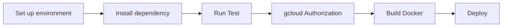

# Yoyo點點名 (YOYO Clock In/Out System)

**Track Time. Boost Productivity.**

*A cloud-native employee attendance tracking system built by Group 9*

---

## 👥 Group 9

| Member | Role | Expertise |
|--------|------|-----------|
| 楊喻妃 | PM | Project Management, Frontend |
| 侯岳昇 | Developer | Backend, DevOps |
| 洪睿謙 | Developer | Backend, QA |
| 徐天祐 | Developer | Frontend, DevOps |
| 陳冠儒 | Developer | Backend, QA |

---

## 🎯 System Overview

The **Yoyo Clock In/Out System** leverages access logs from office gates, parking gates, and other entry points to automatically determine employee clock-in and clock-out times. This eliminates manual time tracking and provides accurate, real-time attendance monitoring.

### 🏗️ System Architecture

 

---

## 📊 Key Features & UI Showcase
### ✅ Smart Check-In/Out Tracking
- **Precise Timestamp Records** with millisecond accuracy
- **Gate & Location Tracking** for comprehensive audit trails
- **Automatic Work Hour Calculation** based on first-in, last-out logic

### 📈 Advanced Attendance Dashboard
- **Real-time Statistics**: Live attendance tracking with instant updates
- **Visual Analytics**: Interactive charts showing attendance trends
- **Calendar Integration**: Monthly view with color-coded attendance status
- **Performance Metrics**: Key performance indicators at a glance

### 📊 Comprehensive Reporting System
- **Data-Driven Insights** with exportable reports
- **Department-specific Attendance Reports** with filtering capabilities
- **Late Arrival Tracking** with automated notifications
- **Trend Analysis** for workforce optimization

### 🏢 Organization Management
- **Dynamic Organizational Structure** with interactive tree visualization
- **Department & Status-based Filtering** for targeted analysis
- **Role-based Access Control** ensuring data security
- **Hierarchical Management** supporting complex org structures

---

## 🏢 User Role Analysis

### 👤 Employee
- Clock in/out functionality
- Check personal records
- Export attendance history

### 👔 Manager  
- Monitor team attendance
- Generate department reports
- Track late arrivals & early departures

### ⚙️ Administrator
- User/Organization management
- System configuration
- Advanced analytics & insights

---

## 🛠️ Development Tools & CI/CD Pipeline

### Project Management
- **Notion**: Comprehensive project documentation and planning
- **GitHub**: Version control with collaborative development

### Testing & Quality Assurance  
- **Unit Testing**: React Testing Library + pytest
- **Test Coverage**: 84% statement coverage rate
- **Quality Gates**: Automated code quality checks

### CI/CD Pipeline

**Frontend Pipeline**: Setup → Install → Test → Auth → Build → Deploy
**Backend Pipeline**: Setup → Install → Create .env → Test → Auth → Deploy

---

**NTU IM 113-2 雲原生應用程式開發**

*Track Time. Boost Productivity. Yoyo點點名.*

---

### 📊 Project Statistics

<table align="center">
<tr>
<td align="center"><strong>📈 Performance</strong></td>
<td align="center"><strong>🧪 Quality</strong></td>
<td align="center"><strong>🚀 Deployment</strong></td>
</tr>
<tr>
<td align="center">
 
 

</td>
<td align="center">
 
 

</td>
<td align="center">
 
 

</td>
</tr>
</table>

---

**[⬆ Back to Top](#yoyo點點名-yoyo-clock-inout-system)**

